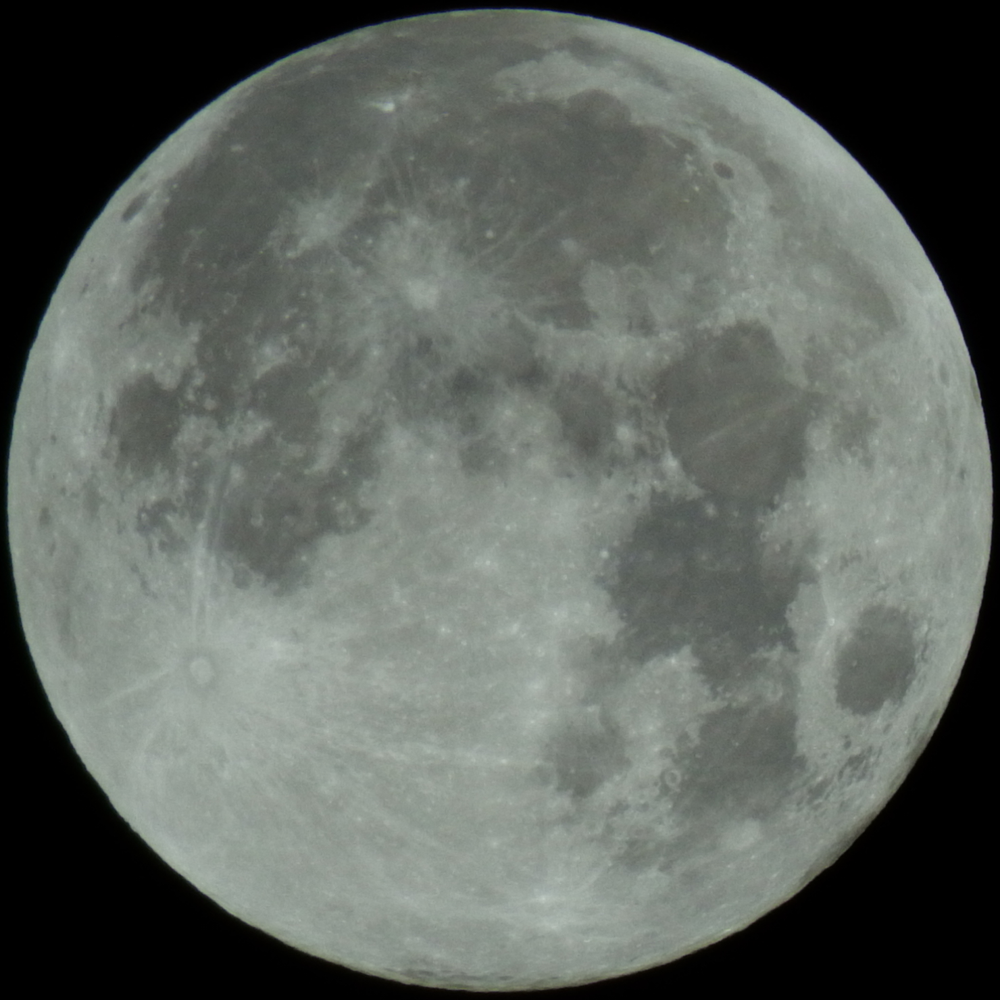
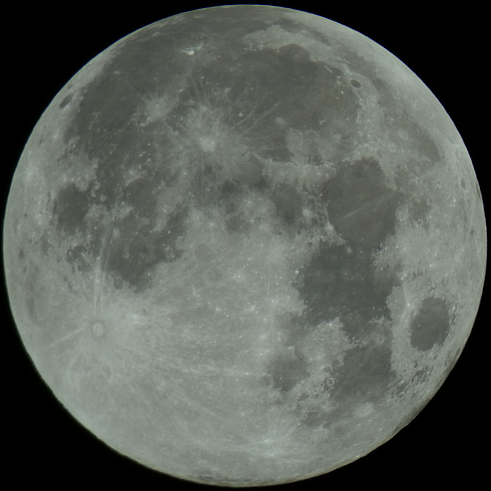

# Moon Stacker

This is my thesis project, focused on stacking multiple RAW images of the moon to produce higher quality and more detailed results. The project involves both classical image processing algorithms and modern machine learning techniques to enhance the final output.

## Features (WIP)

- **Image Alignment**: The program aligns the input images using feature detection algorithms such as ORB and SIFT, and robust matching techniques like RANSAC to ensure proper alignment despite rotation, scaling, or translation differences.

- **Denoising**: 
  - **Classical Methods**: Basic denoising using traditional filters like Gaussian Blur.
  - **Machine Learning**: Advanced neural networks, powered by PyTorch, are employed to reduce noise in the images while preserving important lunar details, ensuring clean and high-quality results.

- **Stacking Algorithms**: After alignment and denoising, the images are combined using traditional stacking algorithms:
  - **Median Stacking**: Reduces noise by taking the median value of each pixel.
  - **Sigma Clipping**: Advanced noise management technique that removes outliers.
  - **Weighted Average Stacking**: Combines images based on calculated weights to enhance image clarity.

- **Image Conversion**: The program supports RAW image input and processes the images internally in 8-bit TIFF format, with the final output being saved in JPEG, PNG ot TIFF format.

## Future Goals

- Expansion to process other types of astronomical images, such as the Milky Way or deep space objects.
- Integration of a graphical user interface to make the program more user-friendly.
- Further performance optimization for faster image processing.

## Example Results

Below is a comparison between the original image and the image after stacking:

 


## How to Use

1. **Install Dependencies**: 

    - Python 3.x
    - OpenCV
    - rawpy
    - numpy
    - imageio

    ```sh
    sudo apt-get install numpy rawpy opencv imageio
    ```

2. **Prepare Images**: Place your RAW images in the `images/raw/` directory (alternatively, you can add your JPEG images into the `jpg` folder, though this is not advised)..

3. **Run the Program**: Execute the main script to start the image processing pipeline.

    ```sh
    cd <path/to/Moon-Stacker>
    python ./src/main.py
    ```

4. **View Results**: The processed images will be saved in the `images/output/` directory. You can see the results of aligning and other adjustings in the 'preprocess' folder.
