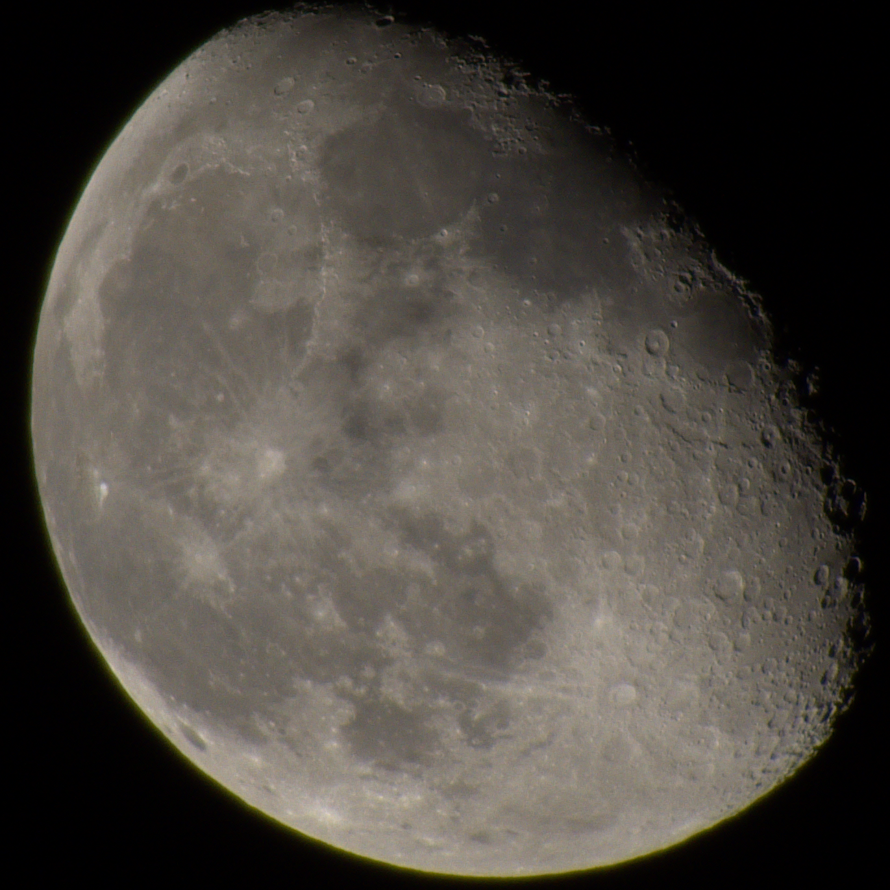
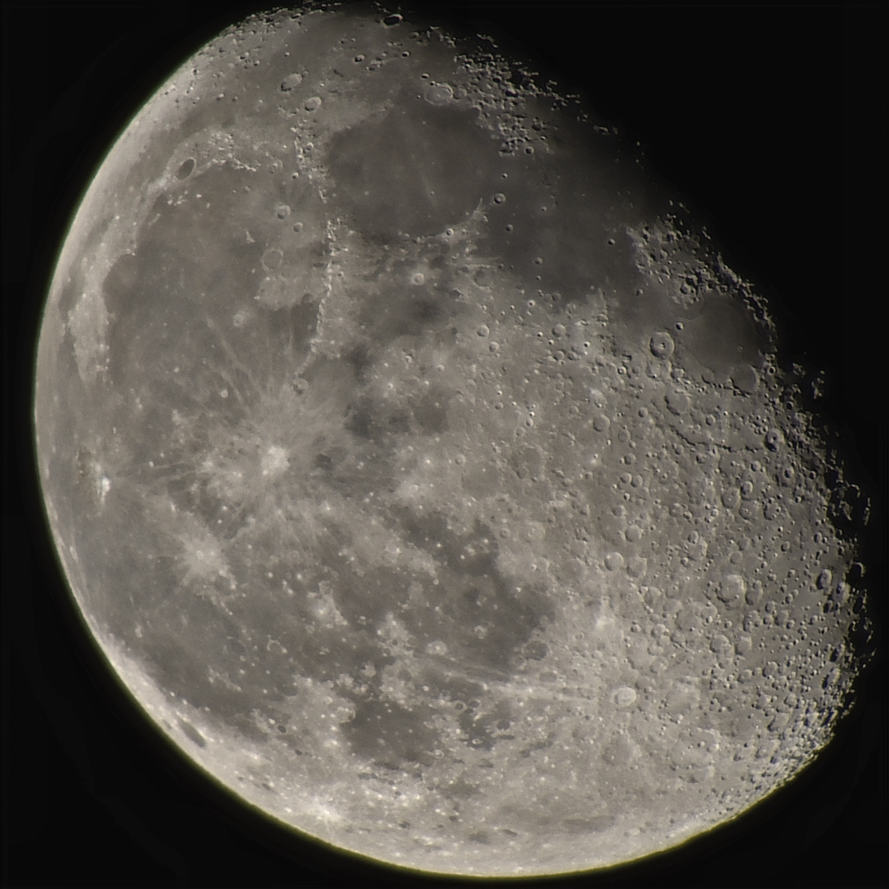

# Moon Stacker

This is my thesis project, focused on stacking multiple RAW images of the moon to produce higher quality and more detailed results. The project involves both classical image processing algorithms and modern machine learning techniques to enhance the final output.

## Features

- **Image Calibration**: The program supports the use of calibration frames to correct the images before stacking:
  - **Bias Frames**: Captured with the shortest possible exposure time and with the lens cap on, these frames help to remove the readout noise from the sensor.
  - **Dark Frames**: Taken with the same exposure time and temperature as the light frames but with the lens cap on, these frames help to remove thermal noise and hot pixels.
  - **Flat Frames**: Captured with a uniform light source, these frames help to correct for vignetting and dust on the sensor.

- **Image Alignment**: The program aligns the input images using feature detection algorithms such as ORB and SIFT, and robust matching techniques like RANSAC to ensure proper alignment despite rotation, scaling, or translation differences.

- **Denoising and unsharping**: 
  - **Classical Methods**: Basic denoising using traditional filters like Gaussian Blur.
  - **Machine Learning**: Advanced neural networks [DnCNN](https://github.com/SaoYan/DnCNN-PyTorch), powered by PyTorch, are employed to reduce noise in the images while preserving important lunar details, ensuring clean and high-quality results.

- **Stacking Algorithms**: After alignment and denoising, the images are combined using traditional stacking algorithms:
  - **Median Stacking**: Reduces noise by taking the median value of each pixel.
  - **Sigma Clipping**: Advanced noise management technique that removes outliers.
  - **Weighted Average Stacking** \[Recommended\]: Combines images based on calculated weights to enhance image sharpness.

- **Image Conversion**: The program supports RAW image input and processes the images internally in float 32 format, with the final output being saved in PNG, JPEG, TIFF and other imageio supported formats.

## Future Goals
- Integration of a graphical user interface to make the program more user-friendly.
- Further performance optimization for faster image processing and lower RAM consuming.

## How to Use

1. **Install Dependencies**: 

    - numpy
    - opencv-python
    - imageio
    - rawpy
    - torch
    - scikit-image
    - rawpy
    - imagecodecs
    - git+https://github.com/chaofengc/IQA-PyTorch.git

    ```sh
    pip install -r requirements.txt
    ```

    the last library is the latest version of pyiqa 

2. **Prepare Images**: Place your RAW images in the `images/lights/` directory (you can also use jpeg images into the 'lights` folder, though this is not advised). If you 

3. **Run the Program**: Execute the main script to start the image processing pipeline.

    ```sh
    cd <path/to/Moon-Stacker>
    python ./src/main.py
    ```

4. **View Results**: The processed images will be saved in the `images/output/` directory.

**Running on Google Colab**

You can also run the program on Google Colab using the provided notebook in the 'colab' folder. Follow these steps:

    - Open the notebook in the 'colab' folder.
    - Upload your images to the appropriate directories in the Colab environment.
    - Run the cells in the notebook to install dependencies, prepare images, and execute the image processing pipeline.
    - The processed images will be saved in the 'output' directory within the Colab environment.

    This allows you to leverage the computational resources of Google Colab for processing your images.

## Example Results

Below is a comparison between the original image and the image after stacking:

 

 